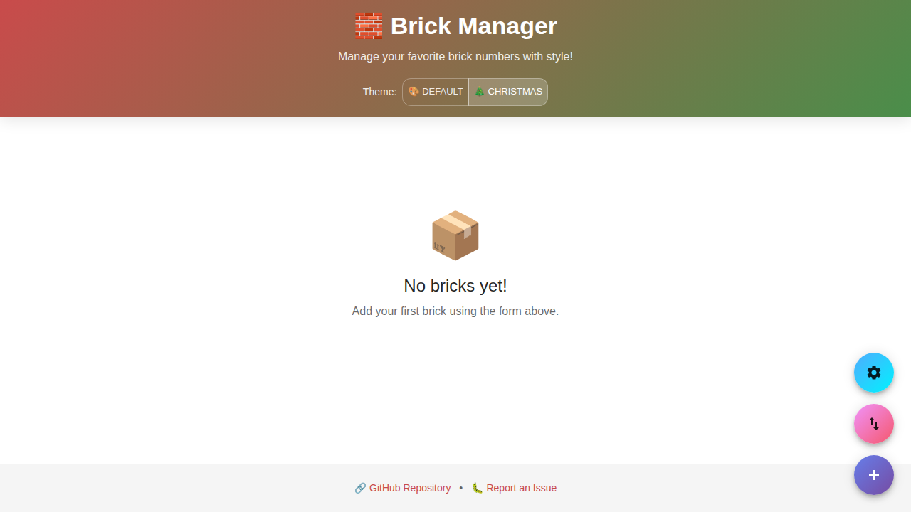
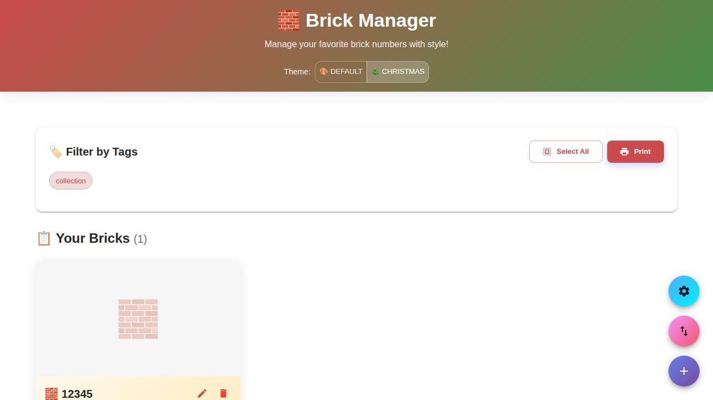
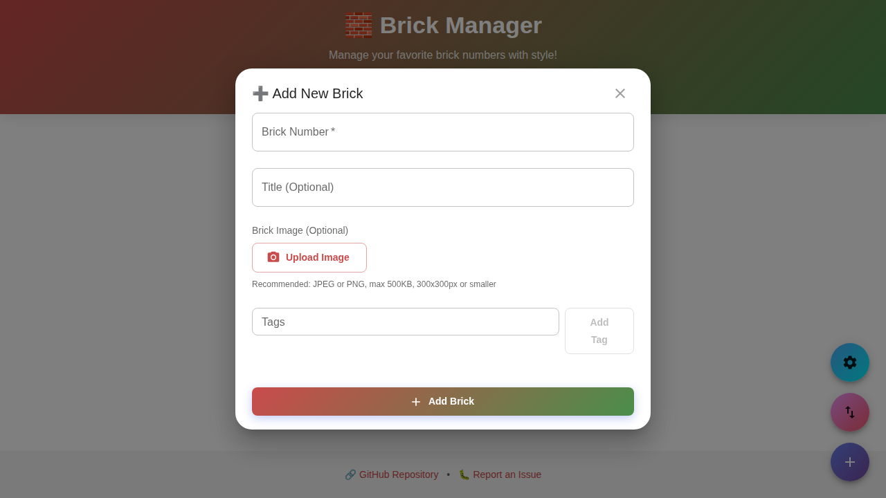

# 🧱 Brick Manager

A modern React web application for managing your favorite brick numbers with optional titles and tags. Built with TypeScript, Vite, and pnpm, featuring a fun and attractive design.



## ✨ Features

- **📝 Manage Bricks**: Add, edit, and delete brick entries with numbers and optional titles
- **🖼️ Brick Images**: Upload and display images for each brick with automatic storage in browser localStorage
- **🏷️ Tag System**: Categorize bricks with custom tags for easy organization
- **🔍 Filter & Sort**: Filter bricks by tags and view them sorted by number
- **💾 Data Persistence**: All data is stored in browser localStorage
- **📦 Import/Export**: Import and export your brick collection in JSON, CSV, or XML formats
- **🖨️ Print View**: Clean, printable brick lists with optional tag filtering
- **🎨 Modern UI**: Beautiful gradient design with smooth animations and responsive layout
- **📱 Mobile Friendly**: Fully responsive design that works on all devices
- **⚡ Fast**: Built with Vite for lightning-fast development and optimized builds
- **🔒 Type Safe**: Written in TypeScript with strict typing

## 🚀 Getting Started

### Prerequisites

- [Node.js](https://nodejs.org/) (v18 or higher)
- [pnpm](https://pnpm.io/) (v8 or higher)

### Installation

1. Clone the repository:
```bash
git clone https://github.com/tiogars/noob-bricks.git
cd noob-bricks
```

2. Install dependencies:
```bash
pnpm install
```

3. Start the development server:
```bash
pnpm dev
```

4. Open your browser and navigate to `http://localhost:5173`

## 🛠️ Available Scripts

- `pnpm dev` - Start development server
- `pnpm build` - Build for production
- `pnpm preview` - Preview production build
- `pnpm lint` - Run ESLint

## 🏗️ Project Structure

The project follows a modular layered architecture:

```
src/
├── components/        # React UI components
│   ├── Header.tsx
│   ├── BrickForm.tsx
│   ├── BrickList.tsx
│   ├── TagFilter.tsx
│   ├── ImportExport.tsx
│   └── PrintView.tsx
├── hooks/            # Custom React hooks
│   └── useBricks.ts
├── models/           # Business logic layer
│   └── brickService.ts
├── storage/          # LocalStorage abstraction layer
│   └── storageService.ts
├── types/            # TypeScript type definitions
│   └── index.ts
├── utils/            # Utility functions
│   ├── exportService.ts
│   └── importService.ts
├── App.tsx           # Main application component
└── main.tsx          # Application entry point
```

## 📖 Usage Guide



### Adding a Brick



1. Enter a brick number (required)
2. Optionally add a title
3. Add tags by typing and pressing "Add Tag" or selecting from quick-add suggestions
4. Optionally upload an image of the brick
5. Click "Add Brick" to save

### Adding Brick Images

- **Supported formats**: JPEG, PNG, GIF, WebP
- **Recommended size**: 300x300 pixels or smaller
- **File size limit**: 500KB maximum (for optimal localStorage performance)
- **Best practices**:
  - Use JPEG for photographs (better compression)
  - Use PNG for images with transparency
  - Resize images before upload to reduce storage usage
  - Consider using square images (1:1 aspect ratio) for consistent display

### Editing a Brick

1. Click the ✏️ edit icon on any brick card
2. Modify the details in the form
3. Click "Update Brick" to save changes

### Filtering by Tags

1. Click on any tag in the "Filter by Tags" section
2. Multiple tags can be selected (shows bricks with ANY of the selected tags)
3. Click "Clear Filter" to show all bricks

### Printing

1. Optionally select tag filters to print only specific bricks
2. Click the "🖨️ Print" button
3. Use your browser's print function (or click the print button in the print view)

### Exporting Data

Choose from three formats:
- **JSON**: Best for backup and data interchange
- **CSV**: Compatible with spreadsheets and databases
- **XML**: Standard structured data format

### Importing Data

1. Click "Import File"
2. Select a JSON, CSV, or XML file
3. Confirm the import (this will replace existing data)

## 🎨 Design Highlights

- **Gradient backgrounds** with purple/pink color scheme
- **Card-based layout** for brick display
- **Smooth animations** for interactions
- **Emoji icons** for visual appeal
- **Responsive grid** that adapts to screen size
- **Print-optimized** view with clean table layout

## 🔧 Technology Stack

- **React 19** - UI framework
- **TypeScript** - Type-safe JavaScript
- **Vite** - Build tool and dev server
- **pnpm** - Fast, disk space efficient package manager
- **ESLint** - Code quality and consistency
- **CSS3** - Modern styling with animations

## 📝 Data Format

### JSON Format
```json
[
  {
    "id": "brick-1234567890-abc123",
    "number": "12345",
    "title": "My First Brick",
    "tags": ["collection", "favorite"],
    "imageUrl": "data:image/jpeg;base64,...",
    "createdAt": "2025-12-20T12:00:00.000Z",
    "updatedAt": "2025-12-20T12:00:00.000Z"
  }
]
```

Note: The `imageUrl` field stores images as base64-encoded data URLs.

### CSV Format
```csv
Number,Title,Tags,Created At,Updated At
12345,My First Brick,"collection; favorite",2025-12-20T12:00:00.000Z,2025-12-20T12:00:00.000Z
```

### XML Format
```xml
<?xml version="1.0" encoding="UTF-8"?>
<bricks>
  <brick>
    <id>brick-1234567890-abc123</id>
    <number>12345</number>
    <title>My First Brick</title>
    <tags>
      <tag>collection</tag>
      <tag>favorite</tag>
    </tags>
    <createdAt>2025-12-20T12:00:00.000Z</createdAt>
    <updatedAt>2025-12-20T12:00:00.000Z</updatedAt>
  </brick>
</bricks>
```

## 🤝 Contributing

Contributions are welcome! Feel free to open issues or submit pull requests.

## 📄 License

This project is open source and available under the MIT License.

## 👏 Acknowledgments

Built with ❤️ using modern web technologies for brick enthusiasts everywhere!

